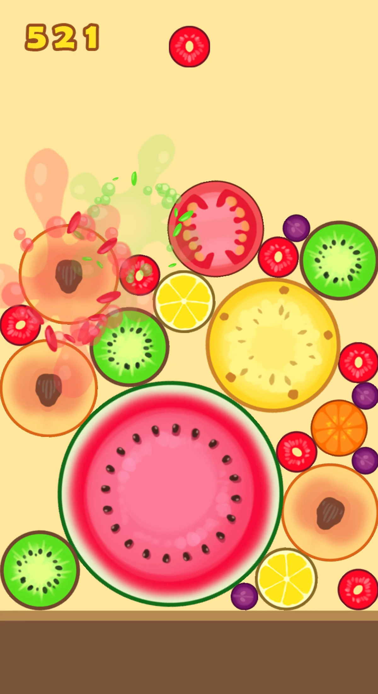

# swan0885_9103_tut02_final_individual_User_input

# wheels-of-fortune — interactive p5.js sketch_User Input

## Part 1: Concept & Inspiration
Inspired by **Pacita Abad’s _Wheels of Fortune_**, this sketch turns spinning ornaments into a small metaphor for **fate vs. choice**. Users “choose” by hovering/clicking; physics “decides” through gravity and bounce.  
The drop mechanic is informed by the game **_Synthetic Watermelon_**, particularly its one-by-one falling sequence and slow accumulation on screen. In a similar way, each click in this sketch releases a single circle from the top, allowing users to observe how repeated drops gradually build, shift, and reorganise the overall composition.
.webp) 
 
---

## Part 2: How to interact
- **Click empty canvas** → **drop** a new circle that falls with gravity and bounces.  
- **Hover over a circle** → that circle **rotates**.  
- **Click a circle** → **remove** it.  
- **Press `1`, `2`, `3` or `4`** → **randomize the background color**.  
- **Press `R` or `r`** → **Restart all**

  
---

## Part 4: Technical explanation

**1. Animation Loop & Structure**
- To enhance user interaction, several key changes were implemented:
- First, `noLoop` was removed to allow `draw()` to run continuously.
- A global `circles` array was introduced alongside the `CircleArt` class to centrally manage each circle's position, rotation, and visibility.

**2. Circle State & Falling Logic**
- I added properties to `CircleArt`, such as `targetY`, `isFalling`,`angle`, `baseRadius`, and `isVisible`, enabling circles to fall from  `y = -200` at a fixed `FALL_SPEED` towards their respective target Y values.
- Each `mousePressed()` triggers `circles[nextCircleIndex]` to begin its descent, achieving sequential falling according to the array order.

**3. Hover Rotation & Visibility Toggle**
- During mouse hover, the `angle` property is incremented in `update()` to impart a gradual rotation effect on the circle.
- Clicking a circle toggles its `isVisible` property, allowing the circle to be hidden or revealed without affecting the drop sequence.

**4. Background Modes & Keyboard Controls**
- Additionally, I implemented `bgColorMode` and keyboard controls: pressing `1–4` cycles through different background colour schemes, while `R/r` resets and regenerates all circles to their initial state.

**5. End State Prompt**
- Upon clearing all circles, a prompt appears on the canvas, guiding the user to press `R` to restart the interaction.

---

## Part 5: Reference & Acknowledgements

- Used the official p5.js documentation to understand animation loops, mouse/keyboard events, and interaction patterns.
- Code structure and interaction patterns were adapted from class materials, example sketches, and my own trial-and-error experimentation.
- Any AI-generated suggestions were treated as drafts, then manually tested, adjusted, and debugged before being included in the final code.
